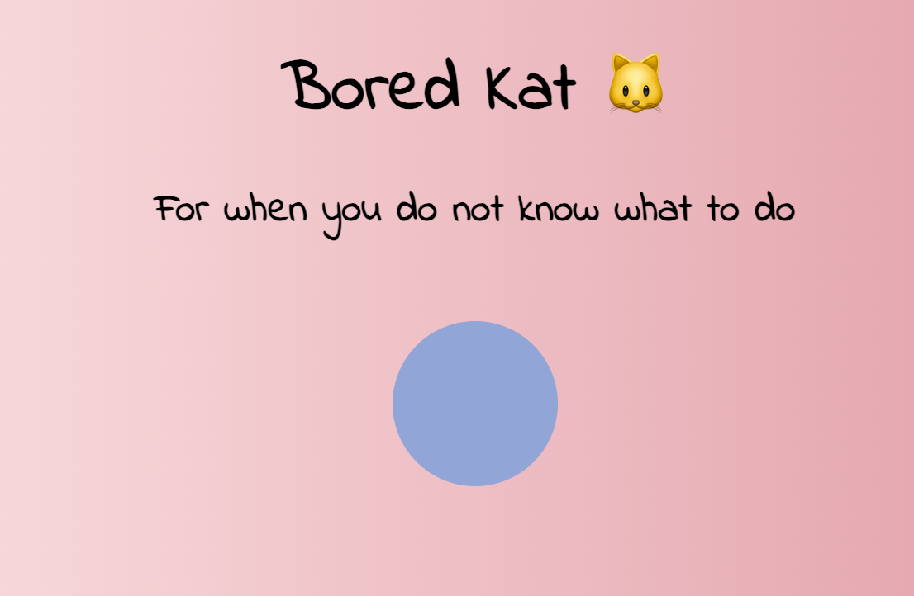
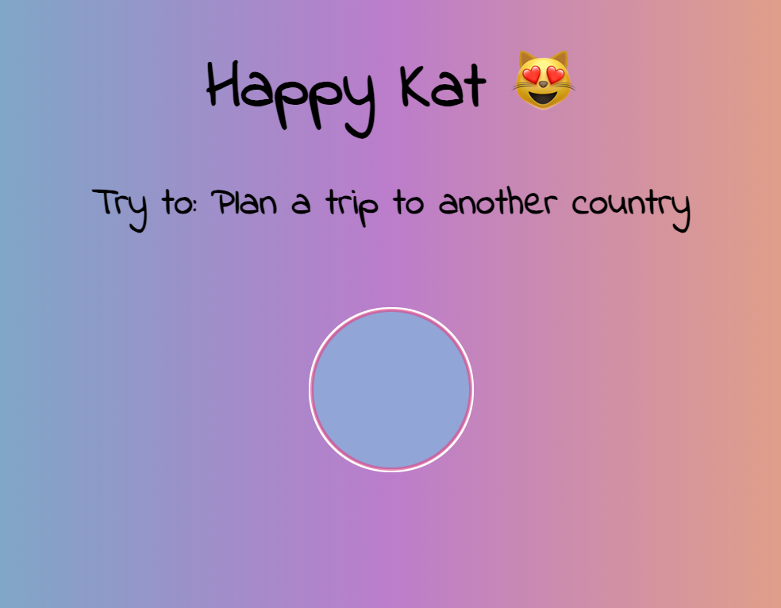

# BoredKat

## Table of contents

-   [Overview](#overview)
    -   [The challenge](#the-challenge)
-   [What I learned](#what-I-learned)

## Overview

### The challenge

The challenge was to create a simple app to play with the fetch sintax.

## What I learned

- fetch()
- intro in working with APIs
- .JSON

